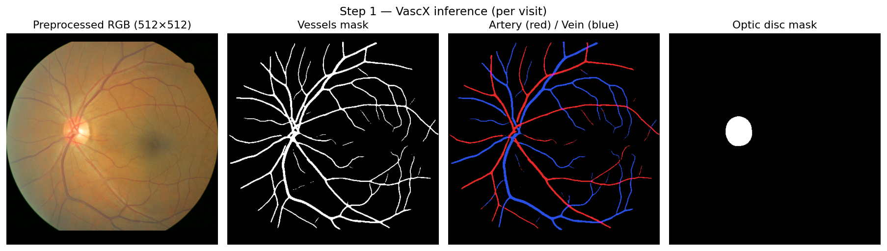
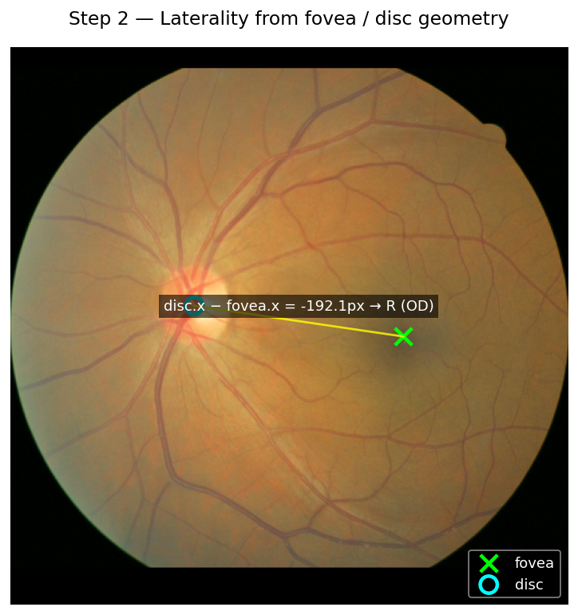
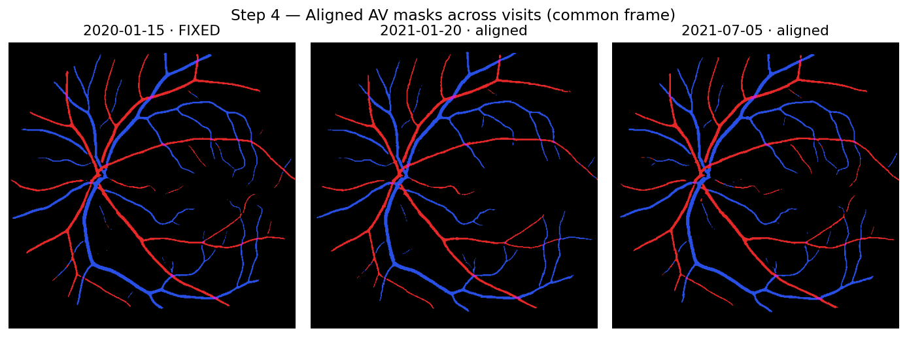
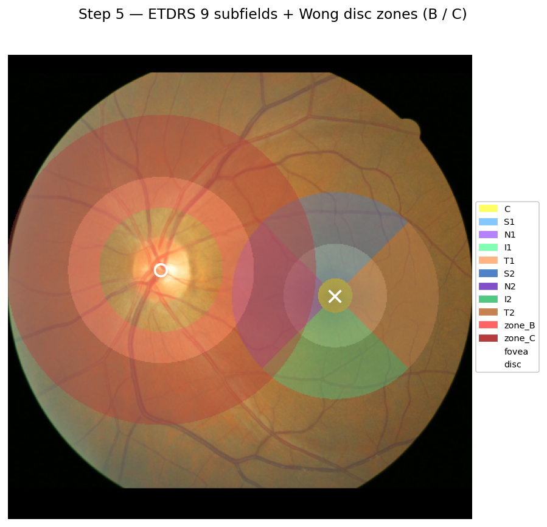
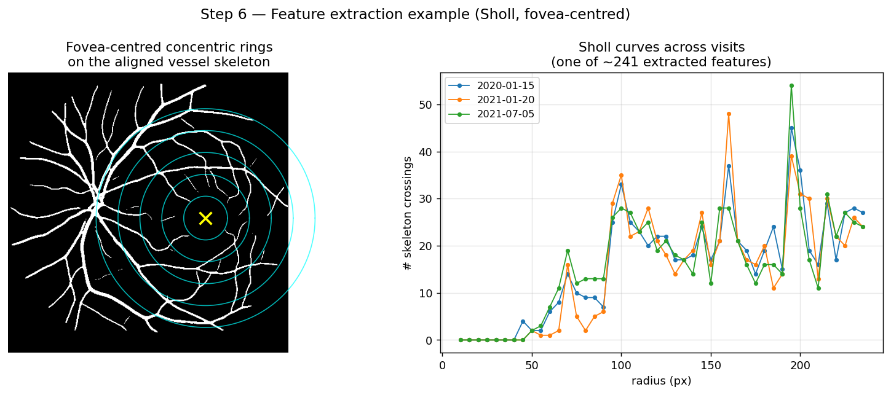

# FundusAlign

Longitudinal retinal vessel biomarker extraction with per-patient image alignment.

Built on **[retinalysis-vascx](https://github.com/Eyened/retinalysis-vascx)** for segmentation and **[EyeLiner](https://github.com/QTIM-Lab/EyeLiner)** for pairwise registration.

Pipeline per patient:
1. VascX inference (vessels, A/V, disc, fovea, quality)
2. EyeLiner affine registration (first visit = fixed, rest warped to it)
3. Extract ~241 biomarkers per visit over fixed ETDRS + Wong disc zones
4. Save per-patient JSON (mergeable to CSV)

---

## Quick start — sample

```powershell
python scripts/run_pipeline.py `
  --csv samples/sample_clinical.csv `
  --src-images samples/images `
  --output-dir samples/output `
  --keep-masks
```

Produces `samples/output/features_512_aligned/SAMPLE.json` (one patient, 3 visits).

For an interactive walkthrough: run `notebooks/01-alignment.ipynb` then `notebooks/02-features-align.ipynb`.

---

## How it works

Six steps, each regeneratable from the sample dataset with `python scripts/make_figures.py` → writes to `docs/`.

### 1. VascX inference — per-visit segmentation
Vessels / artery–vein / optic disc masks + fovea & disc-edge keypoints. Everything downstream is measured off these.



### 2. Laterality from fovea / disc geometry
`disc.x − fovea.x` decides OD vs OS. Small separations are flagged `unknown` and skipped.



### 3. EyeLiner registration
First visit = fixed frame. Each later visit is matched (SuperPoint + LightGlue) and warped by an affine `theta` into that frame. The right panel compares the aligned vessel masks and reports a Dice overlap.


### 4. Aligned masks across visits
Every follow-up now lives in the fixed-visit coordinate system, so pixel `(x, y)` means the same anatomy at every time point.



### 5. ETDRS + Wong zones in the fixed frame
Zones are built once from the fixed visit's fovea / disc geometry; because every visit is already in the fixed frame they stay constant across time.



### 6. Feature extraction (~241 per visit)
Density, skeleton, caliber, fractal, Sholl, color, tortuosity, FAZ, crossings, bifurcation, width variability, junction exponent — all computed inside the fixed zones. Example: Sholl crossings vs radius, one curve per visit.



---

## Full run

```powershell
python scripts/run_pipeline.py `
  --csv path/to/clinical.csv `
  --src-images path/to/raw_images `
  --output-dir path/to/output
```

CLI options: `--keep-masks` · `--top-n N` · `--patient-ids ...` · `--force` · `--limit N` · `--min-visits N`.
Auto-resume: an existing patient JSON is skipped; cached preprocess/inference is reused.

---

## Repository

```
features/      density, skeleton, caliber, topology, color, faz, crossings, zones
scripts/       pipeline_core.py, run_pipeline.py, make_figures.py
notebooks/     01-alignment.ipynb, 02-features-align.ipynb
EyeLiner/      bundled EyeLiner + LightGlue (Apache 2.0 + BSD 3-Clause)
weights/vascx/ VascX weights — download from Google Drive (git-ignored)
samples/       3 de-identified fundus images (one patient, 3 visits)
docs/          pipeline-step figures (regenerated by scripts/make_figures.py)
```

---

## Install

Python 3.11, CUDA GPU.

```powershell
pip install torch==2.11.0 --index-url https://download.pytorch.org/whl/cu128
pip install rtnls_inference rtnls_fundusprep   # Eyened inference framework
pip install -r requirements.txt
```

VascX itself is **not** installed via pip — it lives in this repo:
- `vascx_models/` and `EyeLiner/` are bundled locally (no install needed)
- VascX model weights (~2.2 GB) — download from [Google Drive](https://drive.google.com/drive/folders/1HxpYj-v7D0KX9f0ocvePgG9KT60ElQJh?usp=drive_link) → `weights/vascx/`

---

## Attribution

- **VascX** (segmentation + biomarkers): Vargas-Quiros J.D. et al. *retinalysis-vascx: an explainable software toolbox for the extraction of retinal vascular biomarkers from color fundus images.* 2026. [arXiv:2602.08580](https://arxiv.org/abs/2602.08580). AGPL-3.0.
- **EyeLiner** (registration): QTIM-Lab. Apache 2.0.
- **LightGlue** (feature matching): ETH Zurich. BSD 3-Clause.

Sample images are de-identified from a longitudinal cohort. Patient ID → `SAMPLE`, dates synthetic.
